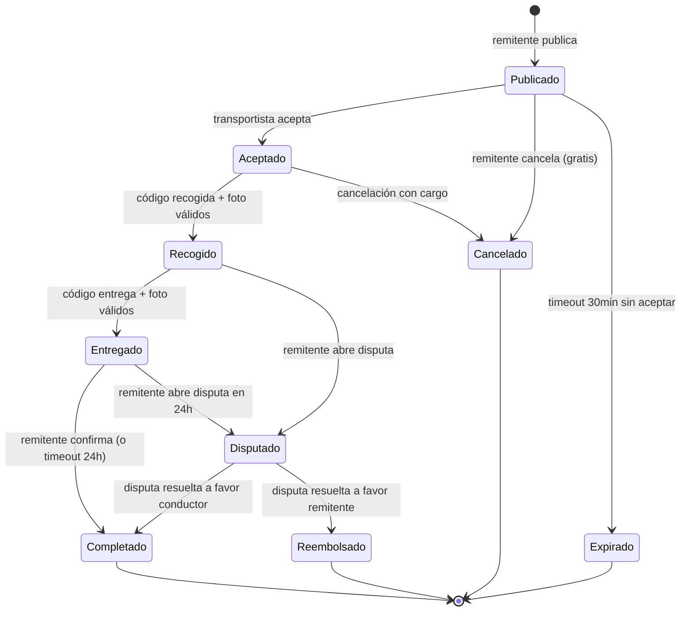

# Skill: State Machine Designer

## Cuándo usar una máquina de estado
- La entidad tiene >2 estados posibles
- Hay transiciones que son inválidas (no se puede ir de A a C sin pasar por B)
- Hay reglas de negocio que dependen del estado actual
- Hay eventos externos que cambian el estado

## Formato del diagrama (Mermaid)



## Implementación en TypeScript

```typescript
// Definir los estados como tipo
type EstadoPorte =
  | 'publicado'
  | 'aceptado'
  | 'recogido'
  | 'entregado'
  | 'completado'
  | 'cancelado'
  | 'disputado'
  | 'expirado'
  | 'reembolsado'

// Definir las transiciones válidas
const TRANSICIONES_VALIDAS: Record<EstadoPorte, EstadoPorte[]> = {
  publicado:   ['aceptado', 'cancelado', 'expirado'],
  aceptado:    ['recogido', 'cancelado'],
  recogido:    ['entregado', 'disputado'],
  entregado:   ['completado', 'disputado'],
  completado:  [],
  cancelado:   [],
  disputado:   ['completado', 'reembolsado'],
  expirado:    [],
  reembolsado: [],
}

// Función de transición que valida
function transicionarPorte(
  estadoActual: EstadoPorte,
  nuevoEstado: EstadoPorte
): EstadoPorte {
  const transicionesPermitidas = TRANSICIONES_VALIDAS[estadoActual]
  if (!transicionesPermitidas.includes(nuevoEstado)) {
    throw new Error(
      `Transición inválida: ${estadoActual} → ${nuevoEstado}. ` +
      `Permitidas: ${transicionesPermitidas.join(', ')}`
    )
  }
  return nuevoEstado
}
```

## Tests unitarios de la máquina de estado

```typescript
describe('Máquina de estados del Porte', () => {
  it('permite transición válida publicado → aceptado', () => {
    expect(transicionarPorte('publicado', 'aceptado')).toBe('aceptado')
  })

  it('lanza error en transición inválida recogido → publicado', () => {
    expect(() => transicionarPorte('recogido', 'publicado'))
      .toThrow('Transición inválida')
  })

  it('no permite modificar un porte completado', () => {
    const estadosFinales: EstadoPorte[] = ['completado', 'cancelado', 'expirado', 'reembolsado']
    estadosFinales.forEach(estado => {
      expect(TRANSICIONES_VALIDAS[estado]).toHaveLength(0)
    })
  })
})
```

## Checklist
- [ ] Todos los estados posibles están definidos
- [ ] Las transiciones válidas están documentadas (diagrama + código)
- [ ] Los estados finales (sin salida) están identificados
- [ ] Los tests cubren transiciones válidas E inválidas
- [ ] Los estados del backend se mapean a estados de UI (qué ve el usuario en cada estado)
