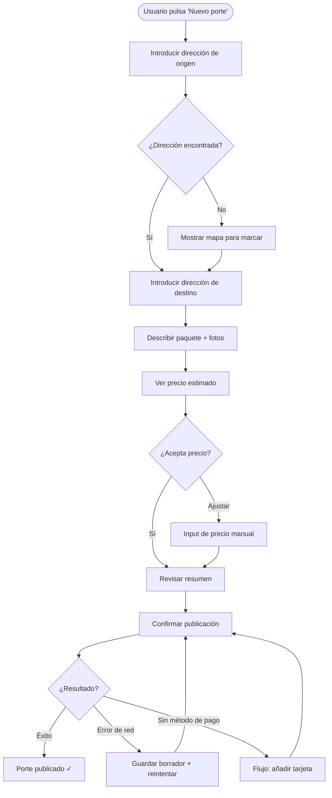

# Skill: UX Flows

## Por qué los flows van antes que las pantallas

Diseñar pantallas antes de tener los flows claros causa:
- Flujos inconsistentes entre pantallas
- Estados vacíos y de error olvidados
- Onboarding confuso
- Re-trabajo cuando el flujo cambia

El flow es el plano de construcción. Las pantallas son la decoración.

## Estructura de un user flow completo

Cada flujo debe cubrir:

```
1. Trigger — ¿qué dispara este flujo? (acción del usuario, notificación, etc.)
2. Pre-condición — ¿qué debe ser verdad para que este flujo empiece?
3. Camino feliz — la secuencia principal sin interrupciones
4. Caminos alternativos — variantes válidas del mismo objetivo
5. Estados de error — qué puede salir mal y cómo se resuelve
6. Estado vacío — primera vez que el usuario ve esta pantalla sin datos
7. Estado de carga — qué ve mientras espera
8. Post-condición — ¿qué es verdad cuando el flujo termina?
```

## Ejemplo: Flujo "Crear porte"

```
TRIGGER: Usuario pulsa "Publicar porte"
PRE-CONDICIÓN: Usuario autenticado, perfil completado

CAMINO FELIZ:
[Formulario origen] → [Formulario destino] → [Detalles del paquete] →
[Precio sugerido / ajuste manual] → [Revisión] → [Confirmar publicación] →
[Confirmación + ver porte activo]

CAMINOS ALTERNATIVOS:
- Guardar como borrador en cualquier paso
- Repetir un porte anterior (pre-rellenar formulario)

ESTADOS DE ERROR:
- Dirección no encontrada → mostrar mapa para marcar manualmente
- Precio < mínimo del sistema → mostrar mínimo recomendado con explicación
- Sin conexión al confirmar → guardar localmente, reintentar al reconectar
- Pago requerido para publicar → flujo de añadir método de pago, volver

ESTADO VACÍO (primera vez):
- Hint en el formulario: "¿Tu primera vez? Aquí tienes cómo funciona"
- Estimación de precio en tiempo real (para que entiendan el valor)

ESTADO DE CARGA:
- Al publicar: animación + mensaje "Buscando transportistas cerca de ti..."

POST-CONDICIÓN:
- Porte con estado 'pendiente' en la BD
- Notificación push a transportistas cercanos
- Usuario ve el porte en "Mis portes activos"
```

## Notación de flow con Mermaid



## Los 5 estados que ninguna pantalla puede ignorar

```
1. LOADING    — datos en tránsito: skeleton screens, no spinners globales
2. EMPTY      — primera vez o sin resultados: no "no hay datos", sino acción clara
3. ERROR      — algo salió mal: mensaje específico + acción de recuperación
4. PARTIAL    — datos parciales / degradados: funcionalidad reducida con aviso
5. SUCCESS    — confirmación de acción completada: feedback claro, qué sigue
```

## Heurísticas de usabilidad (Nielsen) aplicadas

```
1. Visibilidad del estado del sistema
   → El usuario siempre sabe dónde está en el flujo y qué está pasando

2. Control y libertad del usuario
   → Siempre hay un "volver" o "cancelar". No hay callejones sin salida.

3. Prevención de errores
   → Validar en tiempo real, no solo al submit.
   → Confirmar acciones destructivas.

4. Reconocer en vez de recordar
   → Mostrar historial de búsquedas, rellenar campos con datos previos

5. Flexibilidad y eficiencia de uso
   → Shortcuts para usuarios frecuentes (repetir porte anterior)
   → La acción más común es la más accesible
```

## Checklist de un user flow completo

- [ ] ¿Está definido el trigger?
- [ ] ¿Está definido el camino feliz completo?
- [ ] ¿Están definidos los estados de error (al menos los más probables)?
- [ ] ¿Está definido el estado vacío?
- [ ] ¿Está definido el estado de carga?
- [ ] ¿Siempre hay una acción de escape (volver/cancelar)?
- [ ] ¿Las acciones destructivas tienen confirmación?
- [ ] ¿El flow es coherente con el resto de la app (mismos patrones)?
